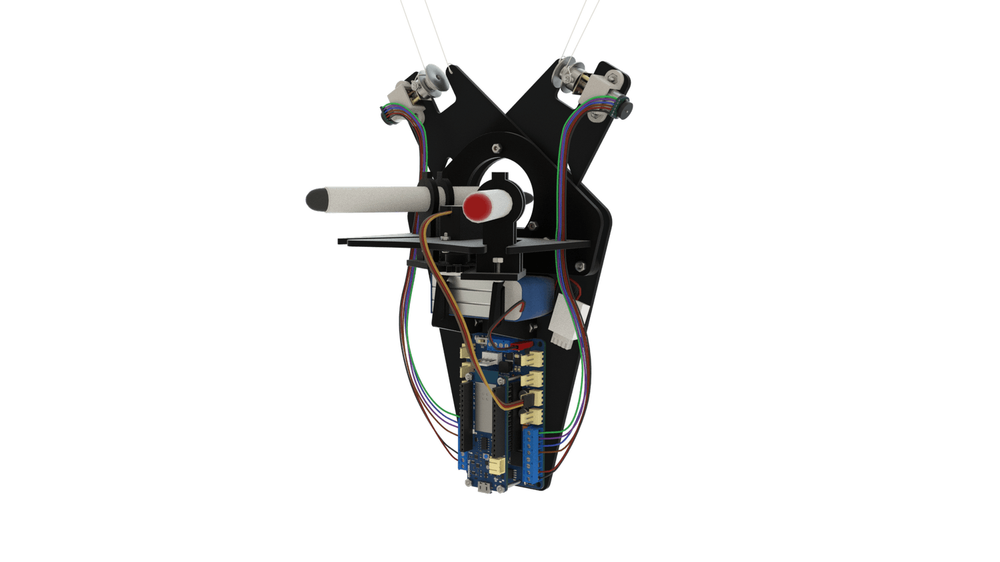

# DRAWING ROBOT
En utilisant le traitement d'image, le calcul de trajectoire et l'optimisation de trajectoire pour la planification de trajectoire, le robot de dessin dessine une image sur un tableau blanc à partir d'une image d'une webcam numérisée par MATLAB. Le robot utilise du code MATLAB pur et la théorie du système de contrôle moteur pour convertir une image physique en un format numérique et sur un tableau blanc.

