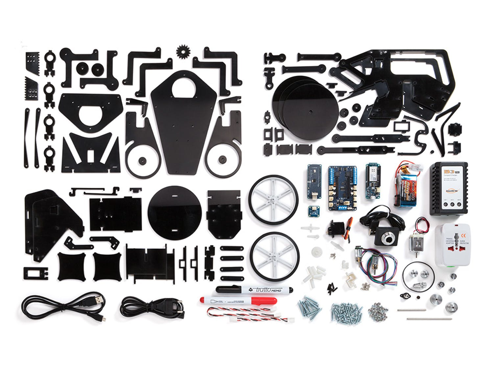
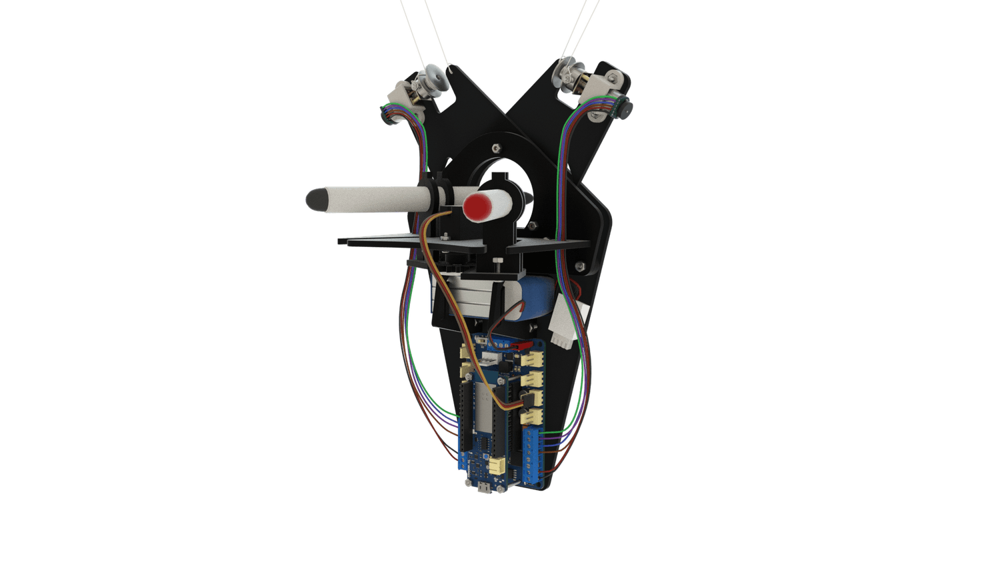
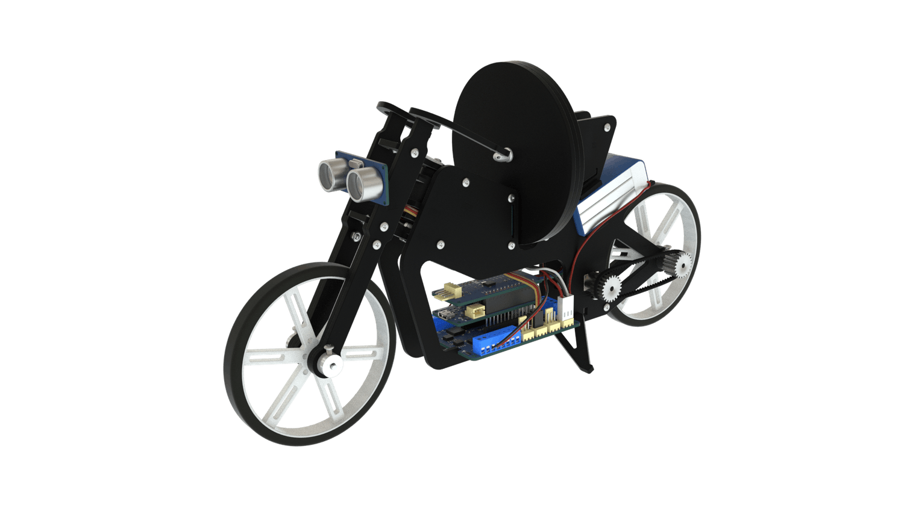

# Arduino-Engineering-Kit
J'ai commencer à travailler sur le KIT ingénieur de Arduino
Mon objectif est de finir avec les projets du KIT

# Outils utilisés
<code>  </code>
<code>  </code>
-----------------
### Arduino et Matlab sont les outils que j'ai utilisé pour réaliser les différents projets su kit

# Les projets du KIT
## Drawing Robot
En utilisant le **traitement d'image**, le **calcul de trajectoire** et l'**optimisation de trajectoire** pour la planification de trajectoire, le robot de dessin dessine une image sur un tableau blanc à partir d'une image d'une **webcam numérisée** par **MATLAB**. Le robot utilise du code MATLAB pur et la théorie du système de contrôle moteur pour convertir une image physique en un format numérique et sur un tableau blanc.

## Mobile Rover
Le Mobile Rover propose un **suivi de position** via une webcam connectée à distance et des fonctions de **détection embarquées** pour éviter les obstacles et se déplacer. Le rover utilise un mélange entre les programmes **MATLAB et Simulink** pour se **déplacer** et **interagir** avec le monde.

## Self Balancing Motorcycle
Doté d'une **dynamique de pendule** inversée utilisant une **roue de réaction** et un **gyroscope de mouvement**, la moto à **équilibrage automatique** peut se **déplacer et s'équilibrer par elle-même**. La moto utilise **Simulink** pour surveiller et contrôler les mouvements, la **détection inertielle** et le filtrage pour équilibrer la moto.

