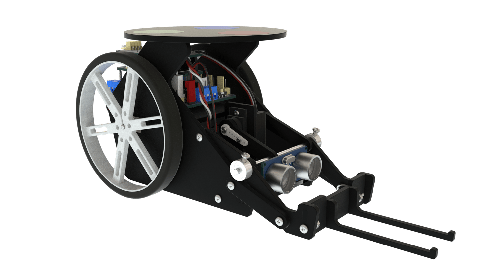

# Arduino-Engineering-Kit
J'ai commencer à travailler sur le KIT ingénieur de Arduino. Mon objectif est de finir avec les projets du KIT.
Le kit d'ingénierie Arduino s'adresse aux étudiants en ingénierie qui souhaitent en savoir plus sur **Arduino**, **MATLAB**, **Simulink** et **Stateflow**. Il a été développé en collaboration entre Mathworks et Arduino. Le kit contient tous les composants nécessaires pour construire trois projets complets, ainsi que du matériel pédagogique avec des explications sur la physique et les mathématiques de la mécatronique. Vous serez initié à la programmation dans quatre langages de programmation différents et découvrirez tout ce qui précède tout en réalisant ces trois projets d'ingénierie difficiles.

# Outils utilisés
<code>  </code>
<code>  </code>
-----------------
### Arduino et Matlab sont les outils que j'ai utilisé pour réaliser les différents projets du kit

# Le contenu du KIT
* __Carte arduino MKR1000__

* __Arduino MKR shield moteur CARRIER__

* __ARDUINO MKR IMU SHIELD__

* __câble USB__

* __Moteur CC__

* __Moteur avec Encodeur__

* __STANDARD MICRO SERVO__

* __HALL SENSOR MODULE__

* __ULTRASONIC SENSOR MODULE__

* __WEBCAM__

* __LIPO BATTERY__

* __MODULE CABLES__

* __ASSEMBLY PIECES__

* __CASTER WHEEL__

* __WHEELS__

* __TIMING BELT__

* __TIMING PULLEYS__

* __DC MOTOR MOUNTING BRACKETS__

* __METAL SHAFT__

* __METAL D SHAFTS__

* __DISTANCE SPACERS__

* __PROPELLER ADAPTER SCREW__

* __NUTS AND BOLTS__

* __ADDITIONAL COMPONENTS__

* __COMPONENTS NEEDED BUT NOT INCLUDED__

# Les projets du KIT
## Drawing Robot
En utilisant le **traitement d'image**, le **calcul de trajectoire** et l'**optimisation de trajectoire** pour la planification de trajectoire, le robot de dessin dessine une image sur un tableau blanc à partir d'une image d'une **webcam numérisée** par **MATLAB**. Le robot utilise du code MATLAB pur et la théorie du système de contrôle moteur pour convertir une image physique en un format numérique et sur un tableau blanc.

## Mobile Rover
Le Mobile Rover propose un **suivi de position** via une webcam connectée à distance et des fonctions de **détection embarquées** pour éviter les obstacles et se déplacer. Le rover utilise un mélange entre les programmes **MATLAB et Simulink** pour se **déplacer** et **interagir** avec le monde.

## Self Balancing Motorcycle
Doté d'une **dynamique de pendule** inversée utilisant une **roue de réaction** et un **gyroscope de mouvement**, la moto à **équilibrage automatique** peut se **déplacer et s'équilibrer par elle-même**. La moto utilise **Simulink** pour surveiller et contrôler les mouvements, la **détection inertielle** et le filtrage pour équilibrer la moto.

